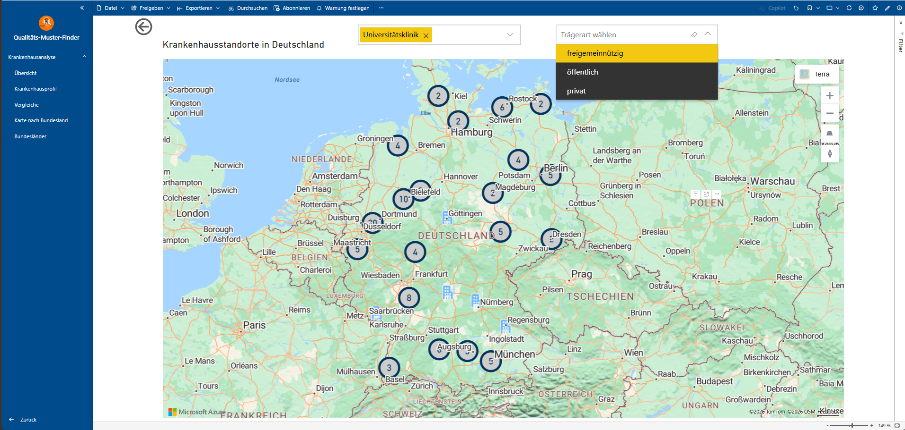
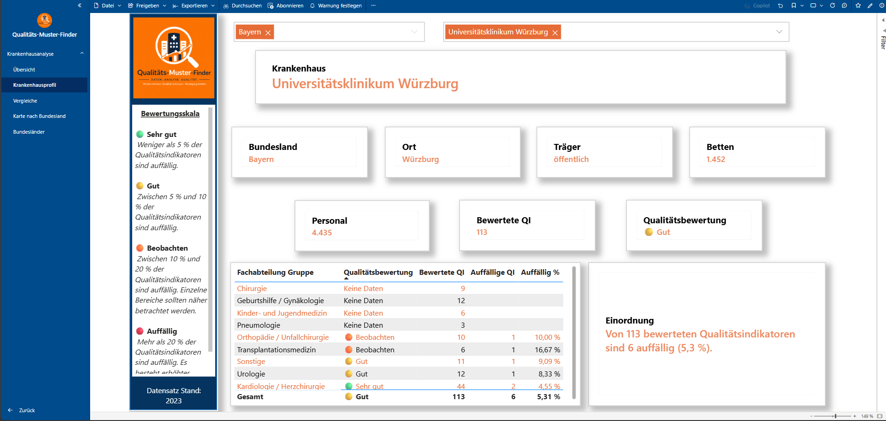
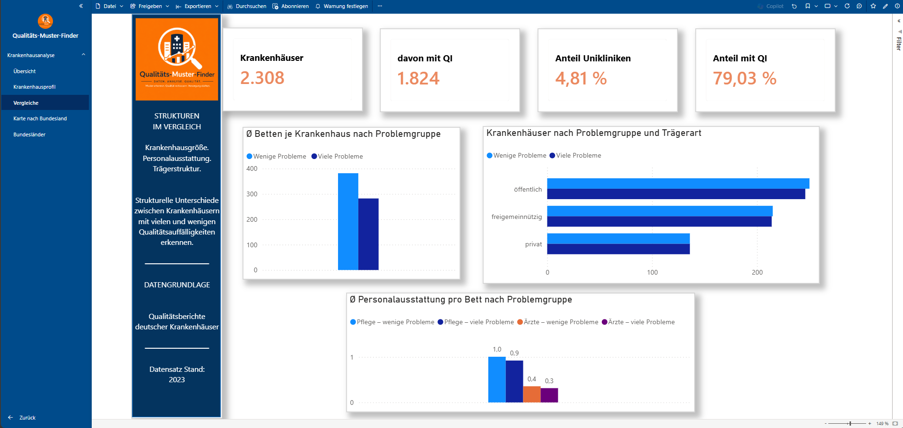
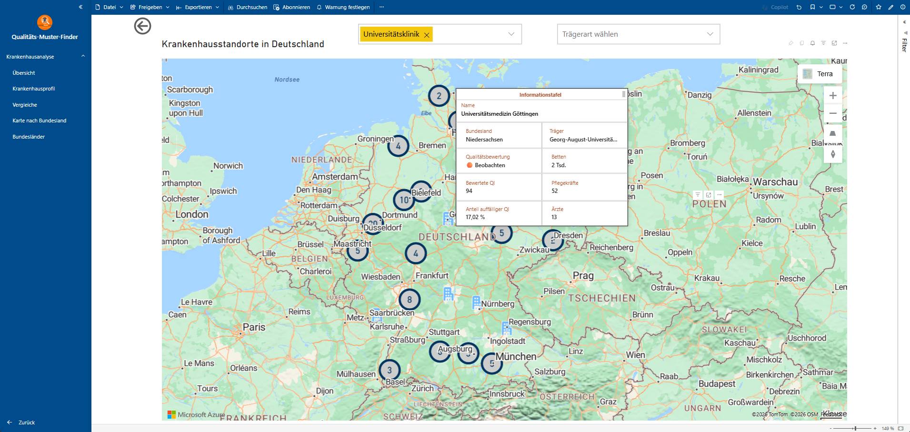

# Power BI Qualitäts-Muster-Finder

Interaktive Power-BI-Analyse deutscher Krankenhaus- und Qualitätsdaten mit DAX, Datenmodellierung, Kartenvisualisierungen und dynamischen Dashboards.

## Projektübersicht

Dieses Projekt analysiert Krankenhaus- und Qualitätsdaten in Deutschland und bereitet die Ergebnisse in einem interaktiven Power-BI-Dashboard auf.

Ziel ist es, komplexe Krankenhausdaten übersichtlich darzustellen, regionale Unterschiede sichtbar zu machen und Vergleiche zwischen Krankenhäusern und Bundesländern zu ermöglichen.

## Verwendete Technologien

- Microsoft Power BI
- DAX
- Power Query
- Datenmodellierung
- Datenvisualisierung
- Interaktive Filter und Slicer
- Kartenvisualisierungen
- KPI- und Qualitätsanalysen

## Dashboard-Übersicht

Die Übersichtsseite stellt zentrale Kennzahlen und Informationen der Analyse kompakt dar.

## Krankenhausstandorte

Darstellung und Analyse von Krankenhausstandorten.

## Analyse nach Bundesland

Die Daten können regional nach Bundesländern ausgewertet und miteinander verglichen werden.

## Kartenanalyse

Die geografische Darstellung ermöglicht einen schnellen Überblick über die regionale Verteilung der analysierten Daten.

## Krankenhausprofil

Detailansicht zur gezielten Betrachtung einzelner Krankenhäuser und relevanter Kennzahlen.

## Vergleiche

Die Vergleichsansicht unterstützt die Gegenüberstellung ausgewählter Kennzahlen und Merkmale.

## Informationstafel

Zusätzliche Informationen und Kennzahlen werden übersichtlich innerhalb des Dashboards bereitgestellt.

## Weiterführende Analyse

Ergänzende Analyseansichten ermöglichen eine vertiefte Untersuchung der Daten.

## Power-BI-Projektdatei

Die zugehörige Power-BI-Projektdatei (`.pbix`) ist ebenfalls Bestandteil dieses Repositorys.

## Projektfokus

Dieses Portfolio-Projekt demonstriert die praktische Anwendung von Power BI zur:

- Aufbereitung und Modellierung komplexer Daten
- Entwicklung interaktiver Dashboards
- Erstellung und Analyse von KPIs
- regionalen und geografischen Datenanalyse
- Visualisierung von Qualitäts- und Krankenhausdaten
- Unterstützung datenbasierter Vergleiche und Entscheidungen

## Autor

**Michael Steglich**

Data Analyst | Power BI | Python | SQL | MongoDB | Business Analysis
